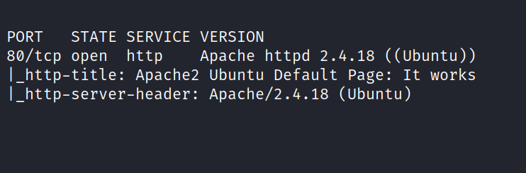
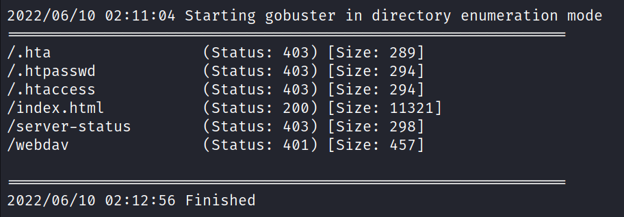
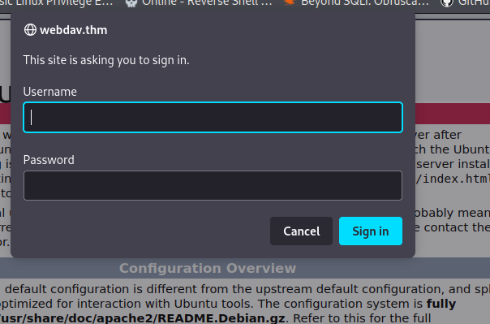
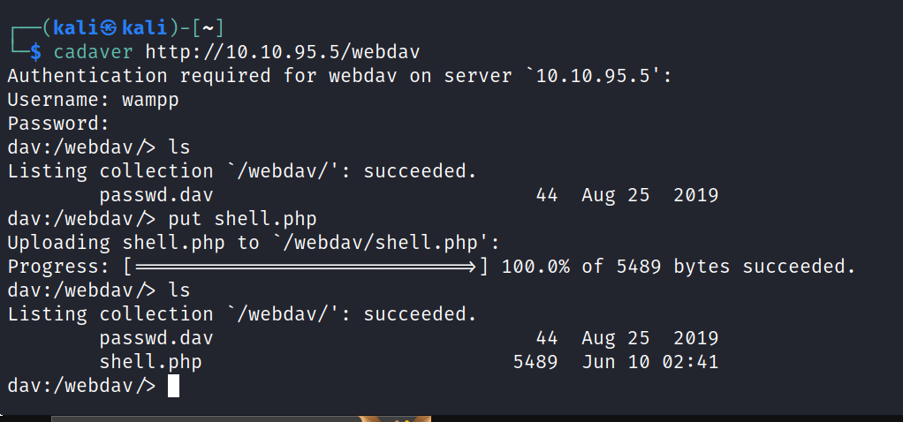
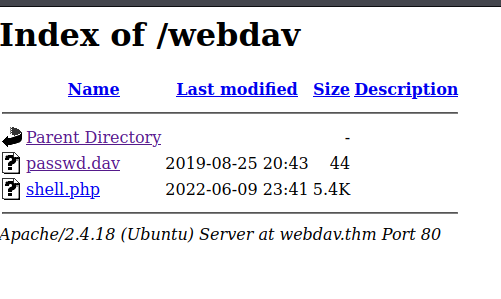
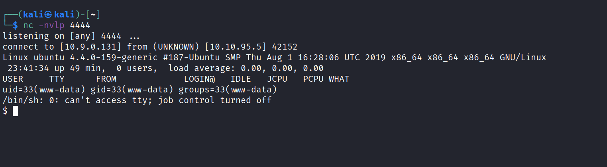
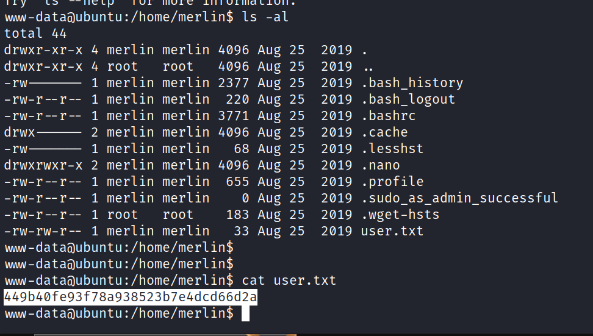
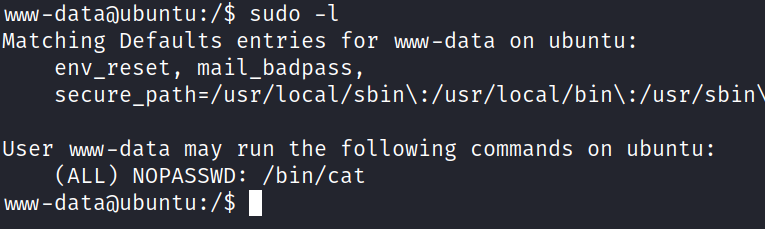
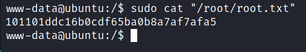

# DAV
10 June 2022
11:52 AM

WebDAV means Web Distributed Authoring and Versioning and allows users
to create, change and move files on a server, so you can think of it as
something like FTP or SMB. Since it works with files management, we can
quickly assume that we’ll need to upload a reverse shell anytime soon.

<a href="https://xforeveryman.blogspot.com/2012/01/helper-webdav-xampp-173-default.html">helper: webdav xampp <= 1.7.3 default credentials</a>

